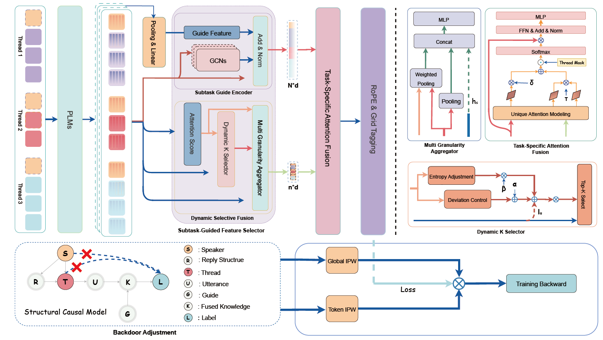

<!-- <p align="center"> -->
<!-- </p> -->
# SGCD
This repository contains data and code for the paper: SGCD: Subtask-Guided Causal-Debiasing Framework for Robust Cross-Utterance Sentiment Quadruple Extraction in Dialogues

## Overview
In this work, we propose a SGCD framework which employs multi granularity attention paths to enhance cross utterance matching and dialogue structure modeling. It also incorporates structural causal graphs and inverse probability weighting to mitigate biases from speakers and thread structures.

<center>

</center>


## Requirements

+ GPU memory requirements 

| Dataset | Batch size | GPU Memory |
| --- | --- | --- |
| Chinese | 2 |  12GB. |
| English | 2 | 24GB. |

The model is implemented using PyTorch. The versions of the main packages:

+ python>=3.8
+ torch>=1.13.1

Install the other required packages:
``` bash
pip install -r requirements.txt
```

## TRAIN

### Training
```
# seed = 41-45
bash script/train.sh
```

## Citation
Our code and datasets are based on [DiaASQ](https://github.com/unikcc/DiaASQ). We appreciate the great help of this work.

If you use the dataset, please cite the following paper:
```
@article{lietal2022arxiv,
  title={DiaASQ: A Benchmark of Conversational Aspect-based Sentiment Quadruple Analysis},
  author={Bobo Li, Hao Fei, Fei Li, Yuhan Wu, Jinsong Zhang, Shengqiong Wu, Jingye Li, Yijiang Liu, Lizi Liao, Tat-Seng Chua, Donghong Ji}
  journal={arXiv preprint arXiv:2211.05705},
  year={2022}
}
```
